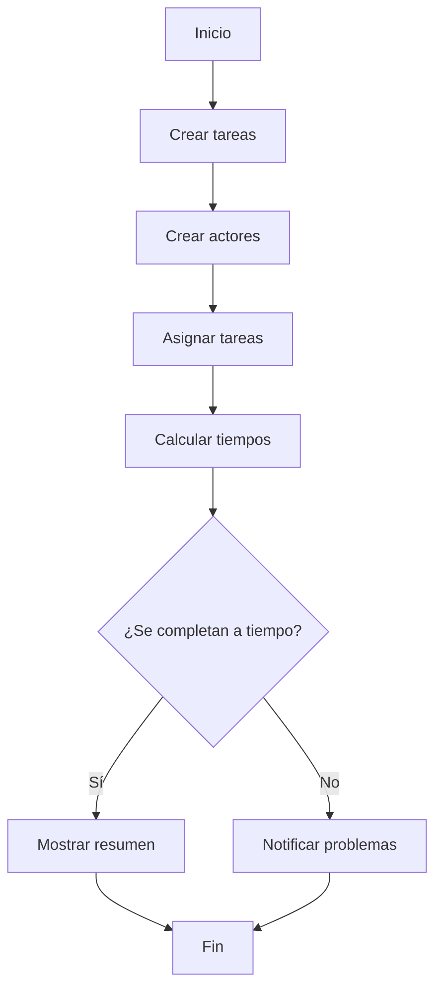

# Examen Parcial 3(Vinculante) - Gonzalo Müller
<details>
  <summary><b>Link del repositorio:</b></summary>
  
  https://github.com/Muller3014/Examen-parcial-3-Gonzalo-Muller.git
  
<br>
<br>
</details>


<details>
  <summary><b>Enunciado del ejercicio</b></summary>
  
# Proyecto de Gestión de Tareas

## Descripción
Este proyecto implementa un sistema para gestionar tareas asignadas a diferentes actores. Cada tarea tiene una descripción, duración y un actor asignado que debe completarla dentro de un marco de tiempo definido. El sistema evalúa si los actores pueden completar sus tareas a tiempo.
<br>
<br>
<br>
<br>
<br>
<br>
<br>
</details>


<details>
  <summary><b>Resolución de gestión de tareas</b></summary>
  
## Estructura del Proyecto

### Clases Principales

#### Clase `Tarea`
Representa una tarea con los siguientes atributos:
- **id**: Identificador único.
- **descripcion**: Descripción de la tarea.
- **duracion**: Duración estimada en minutos.

```cpp
class Tarea {
private:
    std::string id;
    std::string descripcion;
    int duracion;

public:
    Tarea(const std::string& id, const std::string& descripcion, int duracion);
    std::string getId() const;
    std::string getDescripcion() const;
    int getDuracion() const;
    std::string toString() const;
};
```

#### Clase `Actor`
Representa un actor encargado de realizar tareas. Incluye:
- **id**: Identificador del actor.
- **descripcion**: Descripción del actor.
- **tareas**: Lista de tareas asignadas.

```cpp
class Actor {
private:
    std::string id;
    std::string descripcion;
    std::vector<Tarea> tareas;

public:
    Actor(const std::string& id, const std::string& descripcion);
    std::string getId() const;
    std::string getDescripcion() const;
    int addTarea(const Tarea& tarea);
    int getDuracionTotal() const;
    std::string tostring() const;
    std::vector<Tarea> getTareas() const;
};
```

#### Clase `Launcher`
Controlador principal del sistema. Sus funciones incluyen:
- Crear tareas.
- Crear actores.
- Asignar tareas a actores.
- Ejecutar el sistema y mostrar resultados.

```cpp
class Launcher {
public:
    Launcher();
    void ejecutar();
    std::vector<Tarea> getListaDeTareas() const;
    void crearActoresConInput();
    void asignarTareasConInput();
    void imprimirTareas();

private:
    std::vector<Tarea> crearTareas();
    std::vector<Actor> actores;
    std::vector<Tarea> tareas;
};
```

---

## Funcionalidades Detalladas

### Función `main`
Punto de entrada del programa. Inicializa el sistema y ejecuta las funcionalidades de `Launcher`.

```cpp
int main() {
    try {
        Launcher launcher;
        launcher.imprimirTareas();
        launcher.ejecutar();
    } catch (const std::exception& e) {
        std::cerr << "Error: " << e.what() << std::endl;
        return 1;
    }
    return 0;
}
```

### Método `imprimirTareas`
Imprime las tareas almacenadas en el sistema.

```cpp
void Launcher::imprimirTareas() {
    cout << "=== Lista de tareas ===" << endl;
    for (const auto& tarea : tareas) {
        cout << tarea.toString() << endl;
    }
    cout << "=======================" << endl;
}
```

### Método `crearActoresConInput`
Solicita al usuario la información de los actores y los agrega al sistema.

```cpp
void Launcher::crearActoresConInput() {
    int numActores;
    cout << "Ingrese el numero de actores: ";
    if (!(cin >> numActores)) {
        throw runtime_error("Error al leer el numero de actores.");
    }
    cin.ignore();

    for (int i = 0; i < numActores; ++i) {
        string id, descripcion;
        cout << "Ingrese el ID del actor " << i + 1 << ": ";
        if (!getline(cin, id)) {
            throw runtime_error("Error al leer el ID del actor.");
        }
        cout << "Ingrese la descripcion del actor " << i + 1 << ": ";
        if (!getline(cin, descripcion)) {
            throw runtime_error("Error al leer la descripcion del actor.");
        }
        actores.emplace_back(id, descripcion);
    }
}
```

### Método `asignarTareasConInput`
Permite al usuario asignar tareas a los actores.

```cpp
void Launcher::asignarTareasConInput() {
    for (auto& actor : actores) {
        while (true) {
            string respuesta;
            cout << "¿Quieres asignarle una nueva tarea al actor " << actor.getDescripcion() << "? (s/n): ";
            if (!getline(cin, respuesta)) {
                throw runtime_error("Error al leer la respuesta.");
            }

            if (respuesta != "s" && respuesta != "S") {
                break;
            }

            string tareaId;
            cout << "Ingrese el ID de la tarea para el actor " << actor.getDescripcion() << ": ";
            if (!getline(cin, tareaId)) {
                throw runtime_error("Error al leer el ID de la tarea.");
            }

            auto it = find_if(tareas.begin(), tareas.end(), [&tareaId](const Tarea& tarea) {
                return tarea.getId() == tareaId;
            });

            if (it != tareas.end()) {
                actor.addTarea(*it);
            } else {
                cout << "Tarea con ID " << tareaId << " no encontrada." << endl;
            }
        }
    }
}
```

### Método `ejecutar`
Coordina la creación de tareas, la asignación de tareas y calcula el tiempo total para completar las tareas.

```cpp
void Launcher::ejecutar() {
    try {
        tareas = crearTareas();
        crearActoresConInput();
        asignarTareasConInput();

        unordered_map<string, int> taskEndTimes;
        int tiempoTotal = 0;

        cout << "=== Resumen de tareas por actor ===" << endl;

        for (const auto& actor : actores) {
            cout << "Actor: " << actor.getDescripcion() << endl;
            cout << actor.tostring();
            int currentTime = 0;
            for (const auto& tarea : actor.getTareas()) {
                int startTime = currentTime;
                if (taskEndTimes.find(tarea.getId()) != taskEndTimes.end()) {
                    startTime = max(startTime, taskEndTimes[tarea.getId()]);
                }
                int endTime = startTime + tarea.getDuracion();
                taskEndTimes[tarea.getId()] = endTime;
                currentTime = endTime;
            }
            cout << "Tiempo total para " << actor.getDescripcion() << ": " << currentTime << " minutos" << endl;
            tiempoTotal = max(tiempoTotal, currentTime);
            cout << "----------------------------------" << endl;
        }

        cout << "=== Tiempo total para completar todas las tareas ===" << endl;
        cout << "Tiempo total: " << tiempoTotal << " minutos" << endl;

        cout << "\n=== Verificacion de tiempos ===" << endl;
        for (const auto& actor : actores) {
            if (actor.getDuracionTotal() > 100) {
                cout << "El actor " << actor.getDescripcion() << " NO puede completar sus tareas a tiempo." << endl;
            } else {
                cout << "El actor " << actor.getDescripcion() << " puede completar sus tareas a tiempo." << endl;
            }
        }
    } catch (const exception& e) {
        cerr << "Error: " << e.what() << endl;
    }
}
```

---

## Diagrama de Flujo


<br>
<br>
<br>
<br>
<br>
<br>
<br>
</details>

<details>
  <summary><b>Cronograma y Asignación de Tareas</b></summary>


### Agente 1
- **Tarea A**: Reserva de vuelo (0-20 min)
- **Tarea E**: Recoger billete (30-35 min)
- **Tarea F**: Llevar billete a la oficina (35-45 min)
- **Tarea H**: Transportar maletas (50-75 min)

### Agente 2
- **Tarea B**: Informar para empacar (0-5 min)
- **Tarea G**: Recoger maletas (45-65 min)

### Agente 3
- **Tarea I**: Conversar sobre documentos (0-35 min)
- **Tarea K**: Reunir documentos (35-50 min)
- **Tarea L**: Organizar documentos (50-55 min)

### Agente 4
- **Tarea J**: Dictar instrucciones (0-25 min)
- **Tarea D**: Coordinar billete (20-30 min)

### Agente 5
- **Tarea D**: Preparación del billete (20-30 min)

### Familiares en Casa
- **Tarea C**: Empacar maletas (5-45 min)

### CEO
- **Tarea I**: Conversar sobre documentos (0-35 min)
- **Tarea J**: Dictar instrucciones (0-25 min)
-	**Tarea K**: Reunir documentos(35 - 50 min)
-	**Tarea L**: Organizar documentos(50 - 55 min)
-	**Tarea M**: Viajar al aeropuerto y facturar(75 - 100 min)
<br>
<br>
<br>
<br>
<br>
<br>
<br>
</details>


